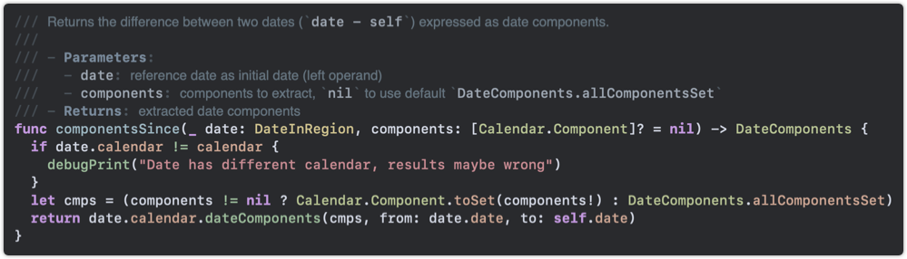

# Cataracted Dark


Example from [SwiftDate](https://github.com/malcommac/SwiftDate)

## Installation

### XCode
```
curl -o ~/Library/Developer/Xcode/UserData/FontAndColorThemes/Cataracted\ Dark.xccolortheme --create-dirs https://raw.githubusercontent.com/betraying/cataracted-dark/master/Cataracted%20Dark.xccolortheme
```

### Visual Studio Code
```
curl -o /Applications/Visual\ Studio\ Code.app/Contents/Resources/app/extensions/theme-defaults/themes/dark_vs.json https://raw.githubusercontent.com/betraying/cataracted-dark/master/Cataracted%20Dark.vscode.json
```
* Press <kbd>⌘</kbd> <kbd>K</kbd> + <kbd>⌘</kbd> <kbd>T</kbd>
* Select `Dark (Visual Studio)`

### iTerm
* `Preferences...`
* `Profiles`
* `Colors`
* `Color Presets...`
* `Import...`
* Select theme file

* `Color Presets...`
* Select the color scheme

### [Sublime Text](https://github.com/betraying/cataracted-dark-sublime-text)
